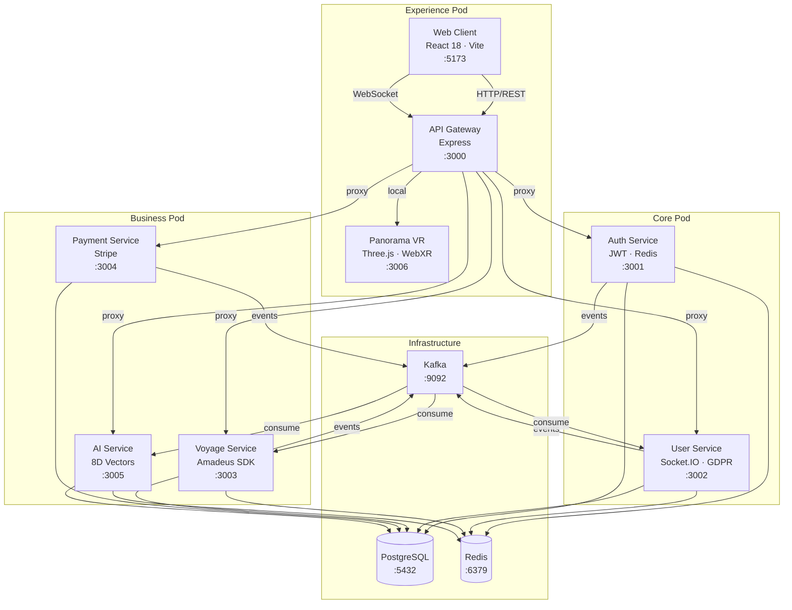

# Architecture DreamScape

## Vue d'ensemble

DreamScape est une plateforme OTA (Online Travel Agency) construite sur une architecture microservices en 3 pods, avec un frontend React, un système de recommandations IA et des expériences VR immersives.

## Diagramme système



## Services

| Service | Port | Pod | Responsabilité principale |
|---------|------|-----|--------------------------|
| API Gateway | 3000 | Experience | Point d'entrée unique, proxy, rate limiting |
| Web Client | 5173 | Experience | Interface utilisateur React SPA |
| Panorama VR | 3006 | Experience | Expériences 360° / WebXR |
| Auth Service | 3001 | Core | Authentification JWT, sessions, tokens |
| User Service | 3002 | Core | Profils, RGPD, notifications, admin |
| Voyage Service | 3003 | Business | Vols, hôtels, activités, panier, réservations |
| Payment Service | 3004 | Business | Paiements Stripe, webhooks |
| AI Service | 3005 | Business | Recommandations vectorielles, cold start |

## Stack technique

### Backend
- **Runtime** : Node.js 18+
- **Framework** : Express 4.18
- **Langage** : TypeScript 5.3 (strict)
- **ORM** : Prisma 5.7 (PostgreSQL)
- **Auth** : JWT (jsonwebtoken 9.0) + cookies httpOnly
- **Cache** : Redis 4.6 / ioredis
- **Events** : Apache Kafka (kafkajs 2.2)
- **Temps réel** : Socket.IO 4.8
- **APIs externes** : Amadeus SDK, Stripe SDK, SendGrid

### Frontend
- **Framework** : React 18.3 + TypeScript 5.5
- **Build** : Vite 5.4
- **State** : Zustand 4.5 + React Query 5.95
- **Styling** : Tailwind CSS 3.4 + Framer Motion 11
- **Maps** : Mapbox GL 2.15
- **i18n** : i18next 25.8 (EN/FR)
- **Paiement** : Stripe React 2.9

### VR
- **3D** : Three.js 0.155
- **React 3D** : @react-three/fiber 8.13, @react-three/drei
- **XR** : @react-three/xr 5.6 (WebXR, Meta Quest 3)

### Infrastructure
- **Conteneurs** : Docker + Docker Compose
- **Orchestration** : Kubernetes (k3s) avec kustomize
- **CI/CD** : GitHub Actions (pipeline en 2 stages)
- **IaC** : Terraform
- **Monitoring** : Prometheus + Grafana

## Architecture Big Pods (déploiement)

En production, les 6 services de développement sont regroupés en **3 pods de déploiement** :

```
Développement (6 services) → Production (3 pods)

Core Pod       = Auth Service + User Service
Business Pod   = Voyage + Payment + AI
Experience Pod = Gateway + Web Client + Panorama
```

**Bénéfices :**
- Latence réduite de 90% (5-15 ms vs 50-100 ms inter-conteneurs)
- RAM réduite de 30% (ressources partagées)
- 50% moins de conteneurs à gérer
- Communication ultra-rapide via NGINX interne (localhost)

Voir : [Big Pods Architecture](docker/big-pods.md)

## Communication entre services

### Synchrone (HTTP/REST)
- Client : axios avec JWT Authorization header
- URLs en dev : `http://localhost:<port>`
- URLs en production (conteneurs) : nom du conteneur Docker
- Format de réponse uniforme : `{ success: boolean, data: object, message?: string }`

### Asynchrone (Kafka)
- Topics : `dreamscape.<domain>.<event>[.<sub-event>]`
- Dégradation gracieuse : les services démarrent même si Kafka est indisponible
- Les événements sont toujours publiés avec `.catch()` pour ne pas bloquer les réponses HTTP

Voir : [Architecture événementielle](event-driven.md)

## Base de données

- **Base unique** PostgreSQL pour tous les services
- **Schéma unifié** Prisma (804 lignes) dans `dreamscape-services/db/`
- **Package partagé** : `@dreamscape/db` (symlink local `file:../db`)
- ~25 modèles couvrant : auth, profils, voyages, paiements, recommandations IA, RGPD, notifications

Voir : [Schéma de base de données](database-schema.md)
