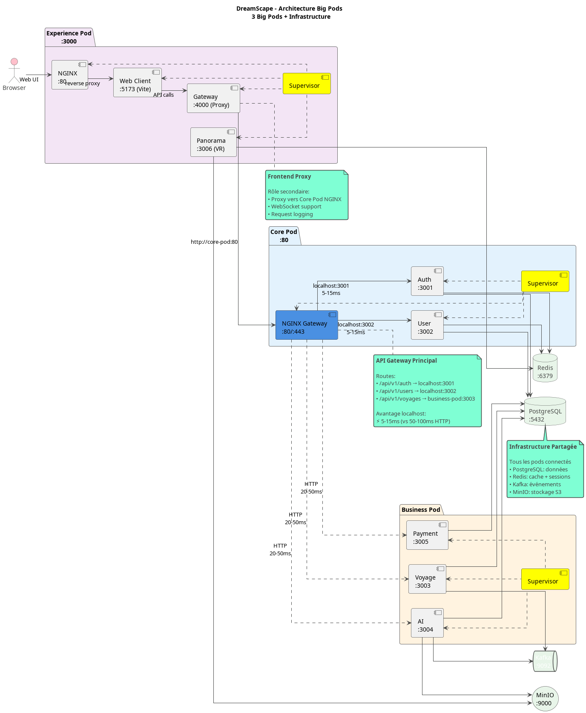
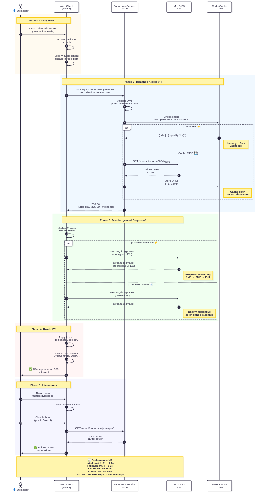
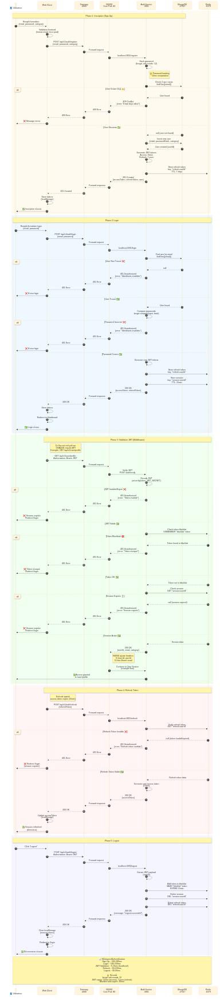
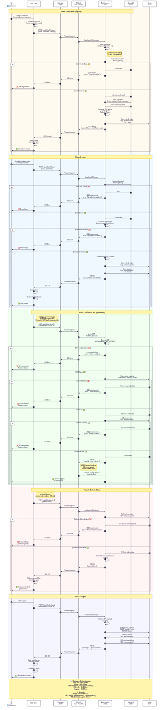

# Architecture DreamScape - Documentation Complète

> **Architecture Hybride Big Pods** - 4 repositories de développement → 3 Big Pods de déploiement

## Table des matières
0. [Prequis](#prerequis)
1. [Vue d'ensemble](#vue-densemble)
<!-- 2. [Architecture Hybride Big Pods](#architecture-hybride-big-pods) -->
<!-- 3. [Diagrammes PlantUML](#diagrammes-plantuml) -->
4. [Composants détaillés](#composants-détaillés)
<!-- 5. [Flux de données](#flux-de-données) -->
6. [Déploiement / Lancement du projet en local](#déploiement)

---

## 0. Prerequis

### Installation Docker

**Docker Engine** (requis)
```bash
# Ubuntu/Debian
sudo apt update && sudo apt install docker.io docker-compose-plugin

# Vérification
docker --version
docker compose version
```

**Permissions utilisateur**
```bash
sudo usermod -aG docker $USER
# Redémarrer la session
```

**Configuration recommandée**
- Docker Engine 24.0+
- Docker Compose V2
- 8GB RAM minimum
- 50GB espace disque libre

### Récupération des Repositories

**Clone des repositories de développement**
```bash
# Créer le dossier de travail
mkdir -p ~/dreamscape-project && cd ~/dreamscape-project

# Cloner les 4 repositories
git clone https://github.com/dreamscape/dreamscape-infra.git
git clone https://github.com/dreamscape/dreamscape-services.git
git clone https://github.com/dreamscape/dreamscape-frontend.git
git clone https://github.com/dreamscape/dreamscape-test.git
```

**Structure finale attendue**
```
~/dreamscape-project/
├── dreamscape-infra/          # Infrastructure & Docker configs
├── dreamscape-services/       # Backend services (AI, Auth, Payment, User, Voyage)
├── dreamscape-frontend/       # Frontend apps (Web-client, Panorama)
└── dreamscape-test/          # Tests & validation
```

**Vérification**
```bash
# Vérifier la structure
ls -la ~/dreamscape-project/

# Vérifier les branches principales
cd dreamscape-infra && git branch -a
cd ../dreamscape-services && git branch -a
cd ../dreamscape-frontend && git branch -a
cd ../dreamscape-test && git branch -a
```
---
## 1. Vue d'ensemble

DreamScape utilise une **architecture hybride** qui combine :
- **4 repositories** pour le développement  
    -  **dreamscape-infra**: repo de l'infrasctuture 
    -  **dreamscape-services** repo des différents services (ai, auth, payment, user, voyage)
    -  **dreamscape-frontend** repo du frontend (panomrama, web-client)
    -  **dreamscape-test**:  repo des tests
- **3 Big Pods** pour le déploiement (efficacité opérationnelle)
    - **experience-pod**: web-client, panorama
        
    - **business-pod**: voyage-service, payment-serice, ai-service
    - **core-pod**: auth-service, user-service

## Diagrame App


## 2. Composant détaillés

### Experience pod - Interface & Expérience Utilisateur

**Rôle :** Gestion de l'interface utilisateur, expériences immersives VR et proxy API frontend

**Services Inclus**
- **Web Client (:5173)**
    Stack technique : React 18 + TypeScript + Vite + TailwindCSS
&nbsp;

    **Responsabilités :**
    ✅ Interface utilisateur principale (recherche vols, réservation)
    ✅ Gestion de l'état (Redux Toolkit / Zustand)
    ✅ Authentification JWT (stockage tokens, refresh)
    ✅ Routing client-side (React Router)
    ✅ Hot Module Replacement (HMR) pour développement
&nbsp;

    **Fonctionnalités clés :**
    - Moteur de recherche de vols
    - Calendrier de disponibilités
    - Formulaire de paiement
    - Profil utilisateur
    - Carte interactive des destinations
&nbsp;

- **Panorama (:3006)**
    **Stack technique :** Node.js + Express + Three.js + WebGL

    **Responsabilités :**

        ✅ Streaming vidéos 360° (destinations VR)
        ✅ Gestion des assets VR (stockage MinIO)
        ✅ API de prévisualisation immersive
        ✅ Optimisation des textures (compression, CDN)
        ✅ Support WebXR (casques VR)
    **Fonctionnalités clés :**

    - Visites virtuelles de destinations
    - Prévisualisation hôtels en VR
    - Navigation interactive (gyroscope, contrôleurs)
    - Galeries photos 360°
    - Vidéos immersives lieux touristiques
&nbsp;

    **Exemple de flux VR :**
    

&nbsp;
- **Gateway (:4000)**
    Stack technique : Node.js + Express + http-proxy-middleware
&nbsp;

    **Responsabilités :**

    ✅ Proxy API vers Core Pod NGINX (:80)
    ✅ WebSocket upgrade (chat, notifications temps réel)
    ✅ Gestion CORS pour frontend
    ✅ Logging des requêtes (monitoring)
    ✅ Retry logic (en cas d'échec temporaire)
&nbsp;
    **Architecture du proxy :**

    **Pourquoi un Gateway séparé ?**

    ✅ Découplage frontend/backend (isolation)
    ✅ Transformation des requêtes si nécessaire
    ✅ Rate limiting côté client
    ✅ Logs centralisés des appels API frontend
&nbsp;

- **Nginx (:80)**
    **Rôle :** Reverse proxy local pour le pod Experience

    **Configuration :**

    **Avantage :** Un seul point d'entrée :3000 pour tout le frontend

**Métriques Experience Pod**
| Métrique | Valeur Cible | Réel (Dev) |
|----------|--------------|------------|
| Cold Start | < 30s | ~25s |
| Hot Reload | < 2s | ~1.5s (Vite HMR) |
| API Latency | < 100ms | ~80ms (via Gateway) |
| VR Load Time | < 5s | ~3.5s (vidéo 360°) |
| Memory | < 512MB | ~400MB |

---

### Core pod - Authentification & Services Critiques
**Rôle :** Gateway API principal, authentification JWT, gestion utilisateurs, cache Redis

**Services Inclus**
- **Nginx Gateway (:80/:443)**
    **Rôle :** API Gateway central de DreamScape

    **Responsabilités :**

    ✅ Reverse Proxy : Route toutes les API vers les bons services
    ✅ Rate Limiting : Protection DDoS (10 req/s auth, 50 req/s API)
    ✅ Load Balancing : Distribution de charge (future échelle)
    ✅ SSL/TLS Termination : HTTPS (certificats Let's Encrypt)
    ✅ CORS Management : Headers sécurisés
    ✅ Health Checks : Monitoring santé     
&nbsp;

    **Configuration clé :**

    **Avantage localhost :**
    ⚡ 5-15ms latency (vs 50-100ms HTTP externe)
    📈 10x plus rapide pour Auth/User
    🔒 Pas d'exposition réseau interne
&nbsp;

- **Auth Service (:3001)**
    Stack technique : Node.js + Express + Passport + JWT + bcrypt

    **Responsabilités :**

    ✅ Inscription utilisateurs (email + password)
    ✅ Login avec JWT (access token + refresh token)
    ✅ Validation tokens (middleware pour toutes les APIs)
    ✅ Gestion sessions (stockage Redis)
    ✅ OAuth2 (Google, Facebook - futur)
    ✅ Réinitialisation mot de passe (email)
&nbsp;

    **API Endpoints :** htpp://localhost:3001/api/v1/

    Auth Service - Complete Route List
    Authentication Routes
    Base: /api/v1/auth

    User Registration & Login
    |Method	| Endpoint	| Description	| Auth Required| 	Rate Limited	| Parameters|
    |-------|-----------|---------------|--------------|--------------------|-----------|
    POST	| /register	| Register a new user	| ❌ No	| ✅ Yes	| email, password, firstName (optional), lastName (optional), username (optional)
    POST	| /login	| Authenticate user and get token	| ❌ No	| ✅ Yes	| email, password, rememberMe (optional)

    Profile Management
    |Method	| Endpoint	| Description	| Auth Required| Parameters|
    |-------|-----------|---------------|--------------|-----------|
    GET	| /profile	| Get current user profile	| ✅ Yes	| None (uses auth token)
    PUT	| /profile	| Update user profile	| ✅ Yes	| email (optional), firstName (optional), lastName (optional), username (optional)

    Password Management
    |Method	| Endpoint	| Description	| Auth Required| Parameters|
    |-------|-----------|---------------|--------------|-----------|
    POST	| /change-password	| Change user password	| ✅ Yes	| currentPassword, newPassword

    Token Management
    |Method	| Endpoint	| Description	| Auth Required| 	Rate Limited	| Parameters|
    |-------|-----------|---------------|--------------|--------------------|-----------|
    POST	| /refresh	| Refresh access token	| ❌ No (refresh token)	| ✅ Yes	| refreshToken (cookie or body)
    POST	| /verify-token	| Verify if token is valid	| ✅ Yes	❌ No	None (validates auth token)

    Session Management
    |Method	| Endpoint	| Description	| Auth Required| Parameters|
    |-------|-----------|---------------|--------------|-----------|
    POST	| /logout	| Logout user and revoke refresh token	| ❌ No	| None (uses cookies)
    POST	| /logout-all	| Logout user from all devices	| ✅ Yes	| None (uses auth token)

    

    **Flux d'authentification :**
    
    **Sécurité :**

     Passwords: bcrypt (salt rounds: 12)
     JWT expiration: 15min (access), 7 jours (refresh)
     Secrets: Variables environnement (JWT_SECRET)
     Rate limiting: 10 tentatives login/min
&nbsp;

    
- **User Service (:3002)**
    Stack technique : Node.js + Express + Prisma ORM

    **Responsabilités :**

    ✅ Gestion profils utilisateurs (CRUD)
    ✅ Préférences voyages (catégories: LEISURE, BUSINESS, etc.)
    ✅ Historique réservations
    ✅ Wishlist destinations
    ✅ Notifications préférences
&nbsp;
    **API Endpoints :** htpp://localhost:3002/

    User Service - Complete Route List
    Profile Routes
    Base: /api/v1/users/profile

    |Method	| Endpoint	| Description	| Auth Required	| Parameters|
    |-------|-----------|---------------|---------------|-----------|
    GET	| /	| Get user profile and settings	| ✅ Yes	| None (uses auth token)
    POST	| /:userId	| Create user profile	| ❌ No|	userId (param), firstName, lastName (body)
    PUT	| /	| Update user profile and settings	| ✅ Yes	| Profile data (body)
    POST	| /:userId/avatar	| Upload avatar	| ❌ No	| userId (param), avatar (file)
    DELETE	| /:userId	| Delete user profile	| ❌ No	| userId (param)

    Activities Routes
    Base: /api/v1/activities (Currently disabled - AmadeusService import issue)

    |Method	| Endpoint	| Description	| Required Parameters|
    |-------|-----------|---------------|--------------------|
    GET	| /search	| Search activities	| (latitude + longitude) OR (north + west + south + east)
    GET	| /details/:activityId	| Get activity details	| activityId (param)
    GET	| /:activityId	| Get activity by ID (alternative)	| activityId (param)

    Health Route
    |Method	| Endpoint	| Description|
    |-------|-----------|------------|
    GET	| /health	| Health check endpoint


**Métriques Core Pod**
| Métrique | Valeur Cible | Réel (Dev) |
|----------|--------------|------------|
| Auth Latency | < 20ms | ~8ms (localhost!) ⚡ |
| JWT Validation | < 10ms | ~5ms (Redis cache) |
| User Profile Load | < 50ms | ~30ms (cache hit) |
| Throughput | 1000 req/s | ~800 req/s |
| Memory | < 1GB | ~750MB |

---

### Business pod - Logique Métier & Intégrations
**Rôle :** Services métier (voyages, IA, paiements), intégrations API externes, traitement événements

**Services Inclus**
- **Voyage Service (:3003)**
    Stack technique : Node.js + Express + Amadeus API + Prisma

    **Responsabilités :**

    ✅ Recherche de vols (intégration Amadeus Flight Offers Search)
    ✅ Prix en temps réel (cache Redis 30min)
    ✅ Gestion réservations (statuts: PENDING, CONFIRMED, CANCELLED)
    ✅ Historique voyages (par utilisateur)
    ✅ Événements Kafka (voyage.booked, voyage.cancelled)
&nbsp;
    **API Endpoints :** http://localhost:3003/
    
    Complete Route List for Voyage Service
    Health & Monitoring Routes
    Base: /api/health 

    | Method	| EndpEndpointoint |	Description|
    |-----------|------------------|---------------|
    GET	| /	| Full health check with all services
    GET	| /ready |	Readiness probe
    GET	|/live	| Liveness probe
    GET	|/cache	|Cache statistics and status

    Flight Routes
    Base: /api/flights

    Search & Discovery
    | Method	| Endpoint	| Description	| Required Parameters|
    |-----------|-----------|---------------|--------------------|
    GET	| /search |	Search flights with mapped DTOs |	originLocationCode, destinationLocationCode, departureDate
    GET	| /destinations	Search | flight destinations (inspiration)	| origin
    GET	| /price-analysis	|	Flight price analysis	| originIataCode, destinationIataCode, departureDate
    GET	| /inspiration	|	Flight inspiration search	| origin
    GET	| /cheapest-dates |	Flight cheapest date search	| origin, destination

    Flight Information
    |Method	| Endpoint	| Description	| Required Parameters|
    |-------|-----------|---------------|--------------------|
    GET	| /status	| Flight status	| carrierCode, flightNumber, scheduledDepartureDate
    GET	| /delay-prediction	| Flight delay prediction	| Multiple (see code)
    GET	| /checkin-links	| Flight check-in links	| airlineCode
    GET	| /seatmap	| Seat map display	| flightOfferId
    GET	| /branded-fares	| Branded fares upsell	| flightOfferId

    Analytics
    |Method	| Endpoint	| Description	| Required Parameters|
    |-------|-----------|---------------|--------------------|
    GET	| /analytics/most-traveled	| Most traveled destinations	| originCityCode, period
    GET	| /analytics/most-booked	| Most booked destinations	| originCityCode, period
    GET	| /analytics/busiest-period	| Busiest traveling period	| cityCode, period

    Booking & Orders
    |Method	| Endpoint	| Description	| Required Parameters|
    |-------|-----------|---------------|--------------------|
    POST	| /choice-prediction	| Flight choice prediction	| Flight offers (body)
    POST	| /offers/pricing	| Flight offers price	| Flight offers (body)
    POST	| /availabilities	| Flight availabilities search	| originDestinations, travelers, sources (body)
    POST	| /orders	| Flight create orders	| Order data (body)
    GET	| /orders/:orderId	| Flight order management	| orderId (param)

    Hotel Routes
    Base: /api/hotels

    |Method	| Endpoint	| Description	| Cache TTL	| Required Parameters|
    |-------|-----------|---------------|-----------|--------------------|
    GET	| /search	| Search hotels	| 5 min	| checkInDate, checkOutDate, (cityCode OR latitude+longitude)
    GET	| /details/:hotelId	| Get hotel details	| 15 min	| hotelId (param)
    GET	| /ratings	| Hotel ratings	| -	| TBD
    POST	| /bookings	| Hotel booking	| -	| Booking data (body)
    GET	| /list	| Hotel list	| 1 hour	| TBD
    GET	| /:hotelId/images	| Get hotel images	| -	| hotelId (param)

    Location Routes
    Base: /api/locations

    |Method	| Endpoint	| Description	| Required Parameters|
    |-------|-----------|---------------|--------------------|
    GET	| /search	| Search locations (cities, airports, etc.)	| keyword
    GET	| /airports	| Search airports	| keyword

    Transfer Routes
    Base: /api/transfers

    |Method	| Endpoint	| Description	| Required Parameters|
    |-------|-----------|---------------|--------------------|
    GET	| /search	| Transfer search	| startDateTime, passengers
    POST	| /bookings	| Transfer booking	| Booking data (body)
    GET	| /orders/:orderId	| Transfer order management	| orderId (param)

    Airline Routes
    Base: /api/airlines

    |Method	| Endpoint	| Description	| Required Parameters|
    |-------|-----------|---------------|--------------------|
    GET	| /lookup	| Airline code lookup	| None (optional: airlineCodes, IATACode, ICAOCode)
    GET	| /routes	| Airline routes	| airlineCode

    Airport Routes
    Base: /api/airports
    |Method	| Endpoint	| Description	| Required Parameters|
    |-------|-----------|---------------|--------------------|
    GET	| /on-time-performance	| Airport on-time performance	| airportCode, date
    GET	| /nearest	| Airport nearest relevant	| latitude, longitude
    GET	| /routes	| Airport routes	| departureAirportCode
        

    **Intégration Amadeus :**

    **Flux de réservation :**

    

    **Connexions :**
&nbsp;

- **AI Service (:3004)**
    Stack technique : Python (FastAPI) + TensorFlow + OpenAI API + MinIO


    **Responsabilités :**

    ✅ Recommandations personnalisées (ML model: collaborative filtering)
    ✅ Génération d'itinéraires (OpenAI GPT-4)
    ✅ Prédiction de prix (time series forecasting)
    ✅ Analyse de sentiment (avis destinations)
    ✅ Chatbot voyage (RAG sur base de connaissances)
&nbsp;

    **API Endpoints :** http:/localhost:3004/

AI Service - Complete Route List
Recommendations Routes
Base: /api/v1/recommendations

|Method	| Endpoint	| Description	| Auth Required	| Required Parameters| 
|-------|-----------|---------------|---------------|--------------------|
GET	| /	| Get travel recommendations	| ❌ No	| cityCodes

Optional Parameters:
travelerCountryCode - Country code of the traveler
destinationCountryCode - Country code of the destination

Predictions Routes
Base: /api/v1/predictions

|Method	| Endpoint	| Description	| Auth Required	| Required Parameters| 
|-------|-----------|---------------|---------------|--------------------|
GET	| /trip-purpose	| Predict trip purpose	| ❌ No	| originLocationCode, destinationLocationCode, departureDate, searchDate,returnDate(optional)


Health Route
|Method	| Endpoint	| Description|
|-------|-----------|------------|
GET	| /health	| Health check endpoint

&nbsp;

- **Payment Service (:3005)**
    Stack technique : Node.js + Express + Stripe API + Prisma
&nbsp;

    **Responsabilités :**

    ✅ Création Payment Intent (Stripe)
    ✅ Webhook Stripe (confirmation paiements)
    ✅ Gestion remboursements
    ✅ Historique transactions
    ✅ Sécurité PCI-DSS (pas de stockage carte)
&nbsp;

    **API Endpoints :** http://localhost:3005/

    **Flux de paiement :**
    

    **Sécurité :**

    🔒 PCI-DSS Compliant (Stripe gère les cartes)
    🔐 Webhook signature (validation Stripe-Signature header)
    🚫 Idempotency keys (évite double paiement)
    📝 Audit logs (toutes transactions loggées)
    Exemple code Stripe :
&nbsp;

**Métriques Business Pod**
| Métrique | Valeur Cible | Réel (Dev) |
|----------|--------------|------------|
| Voyage Search | < 2s | ~1.5s (cache hit) / ~3s (Amadeus) |
| AI Recommendations | < 500ms | ~350ms (model inference) |
| Payment Intent | < 1s | ~800ms (Stripe API) |
| Throughput | 500 req/s | ~400 req/s |
| Memory | < 2GB | ~1.5GB |

---

### Infratructuture - base de donnée , S3 
- **Redis (:6379)**
**Rôle :** Cache applicatif + stockage sessions

**Utilisations :**

**Configuration :**

**Avantages :**
⚡ Latency < 1ms (in-memory)
📈 Réduit charge Postgres de 60-80%
🔄 TTL automatique (sessions expirées supprimées)
🔧 Supervisor

**Rôle :** Process manager (PID 1 du container)

**Configuration :**

**Pourquoi Supervisor ?**

✅ Gère 3 processus simultanés (nginx + auth + user)
✅ Auto-restart on crash (container ne meurt pas)
✅ Logs centralisés (/var/log/supervisor/)
✅ Ordre de démarrage contrôlé (priorities)


---

### Solution Big Pods : 

Gain : -90% latence sur Auth/User ! 🚀

Exemple Concret : Validation JWT
Scénario : User fait une recherche de vol

Performance totale : ~600-800ms (dont 90% API Amadeus)

Si Auth était en microservice séparé :

Validation JWT: 50-100ms au lieu de 5-15ms
+100ms sur CHAQUE requête API !

---

## 6. Deploimenent

 1. Remplir toutes les conditions du [prérequis](#prerequis). 
 2. Copier le fichier d'environnement
 3. lancer le script de generation des secrets: [dreamscape-infra/scripts/bigpods/generate-dev-secrets.sh](dreamscape-infra/scripts/bigpods/generate-dev-secrets.sh)
 4. Ajouter ces clées personneles pour les différentes API
 5. Lancer le script de dev [dev-bigpods.sh](dreamscape-infra/scripts/bigpods/dev-bigpods.sh)
 6. Lancer le script de deploiment [deploy-bigpods.sh](dreamscape-infra/scripts/bigpods/deploy-bigpods.sh)

